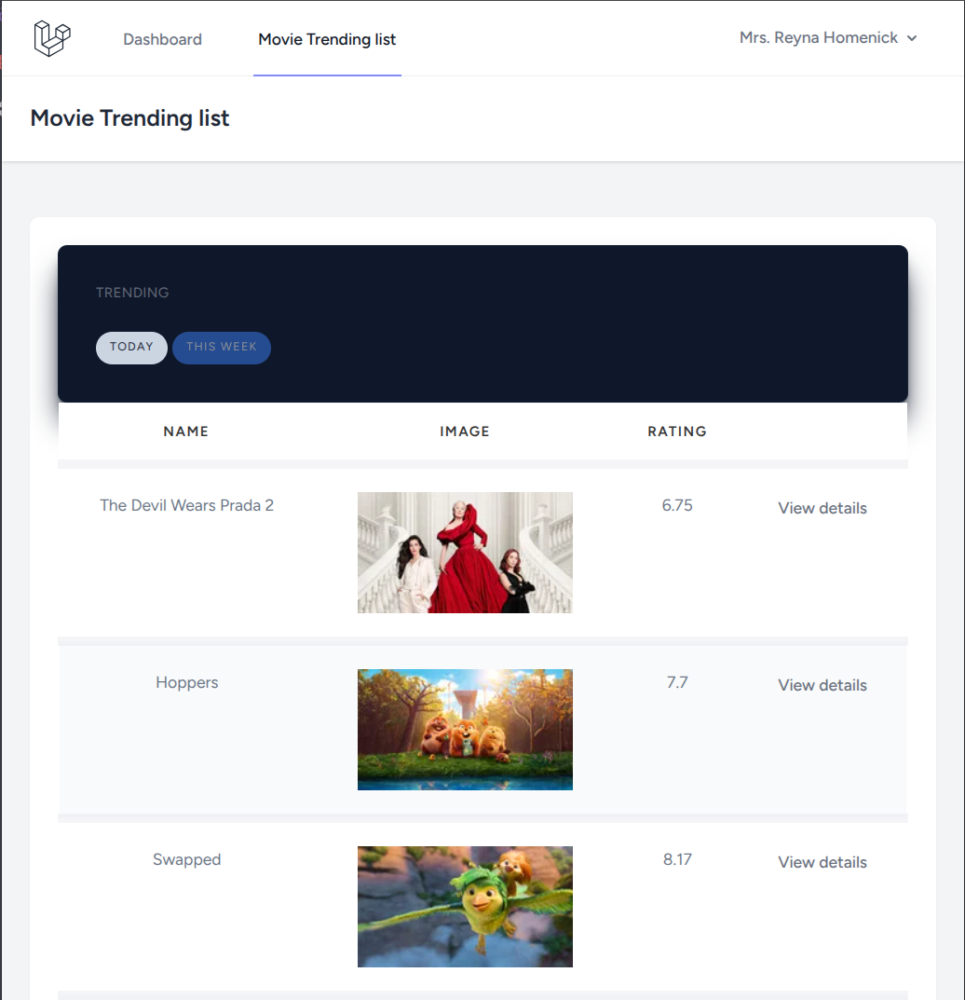

## Movie Catalog Application

### Basic description of the application

Sample application, that allows to show to the authentified user the trending list of movies, fetched from [TMDB](https://www.themoviedb.org/)  

The list of key features
* statistics is fetched and stored in the app's database
* statistics is updated by schedule (once per day/week), manual update is also possible
* it's possible to choose trending movies for the current day or the week
* the list of movies is paginated
* a separate page with the details of corresponding movie is available

### Create a local development instance from scratch

- Prerequisites: installed locally [docker](https://docs.docker.com/get-docker/) and [docker-compose](https://docs.docker.com/compose/install/)
- Clone the repository: `git clone git@github.com:staradzinau/app-movie-catalog.git`
- Go down to the new directory: `cd app-movie-catalog`
- Create the env file from the template: `cp .env.example .env`
- Adjust variables in the `.env` file. At least, it's necessary to specify API key for TMDB, see `TMDB_API_KEY`
- Install Composer dependencies: `docker run --rm -u "$(id -u):$(id -g)" -v "$(pwd):/var/www/html" -w /var/www/html laravelsail/php82-composer:latest composer install --ignore-platform-reqs`. See details [here](https://laravel.com/docs/10.x/sail#installing-composer-dependencies-for-existing-projects)
- Start Laravel Sail: `./vendor/bin/sail up -d`, see details [here](https://laravel.com/docs/10.x/sail#starting-and-stopping-sail)
- Generate the key for the application: `./vendor/bin/sail artisan key:generate`. [Details](https://laravel.com/docs/10.x/encryption#configuration)
- Migrate your database: `./vendor/bin/sail artisan migrate`
- [OPTIONAL] To create 1 default user, seed the app's database with the command  `./vendor/bin/sail artisan db:seed`. Email and password of the newly created user can be found/edited in the `.env` file, see `USER_DEFAULT_EMAIL` and `USER_DEFAULT_PASSWORD`
- Set up the frontend with 2 consecutive commands: `./vendor/bin/sail npm install` and then `./vendor/bin/sail npm run dev`
- The application is ready. Available by the `APP_URL` parameter value in the `.env` file ([default](http://localhost/)). Mailpit email testing tool UI: [http://localhost:8025/](http://localhost:8025/)
- The details about movies and trendind list is updated automatically in the midnight. To trigger fetching details manually, please, execute the following console command (Sail-version): `./vendor/bin/sail artisan app:movie:trending-list:update {time-window}`, where instead `{time-window}` you should use `day` or `week` to fetch data for corresponding time window

When the application is already deployed, following 2 commands would be enough to run the app: `./vendor/bin/sail up -d` and `./vendor/bin/sail npm run dev`

### Technical details

Details over the tech stack used
* PHP 8.1
* Laravel 10 with Sanctum, Breeze and Tinker packages.
* Local dev environment is containerized using Laravel Sail package
* For the frontend, the Blade is used as templating engine

During the development of the app, [the TMDB official documentation](https://developer.themoviedb.org/docs) has been used: 

To simplify and formalize usage of TMDB, recommended library has been added, [php-tmdb-api](https://github.com/php-tmdb/api). Durig the development process, I haven't faced with API limits regarding frequency of requests

Additional packages were added:
- [mkocansey/bladewind](https://github.com/mkocansey/bladewind): useful collection of UI components 
- [barryvdh/laravel-debugbar](https://github.com/barryvdh/laravel-debugbar): powerful debug bar
- [laravel/breeze](https://github.com/laravel/breeze): official Laravel starter kit to support authentication features
